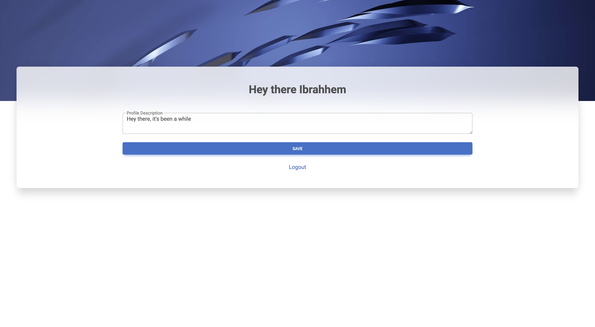

# C-Server 
**Multi-Connection HTTP Server in C**

## Table of Contents

* [Introduction](#introduction)
* [Features](#features)
* [Screenshots](#screenshots)
* [Project Structure](#project-structure)
* [Routing Overview](#routing-overview)
* [Modules](#modules)

  * [Module: httpd](#module-httpd)
  * [Module: user](#module-user)
  * [Module: session](#module-session)
  * [Module: response](#module-response)
  * [Module: handlers](#module-handlers)
* [Installation](#installation)
* [Running the Server](#running-the-server)
* [Cleaning Build Files](#cleaning-build-files)
* [Notes](#notes)

---

## Introduction

**CServer** is a multi-threaded HTTP server written in C that supports user registration, login, session management, and profile editing via a web interface. It handles multiple connections concurrently by spawning a new process (`fork()`) for each incoming request. The server uses plain text files for data storage. The project demonstrates key system programming concepts such as low-level socket handling, token-based sessions, modular C design, and basic templating for web responses.

The server is modularized into five key components:

* **httpd** – core networking and request parsing
* **response** – HTML generation, redirects, and static file serving
* **user** – user management and profile data
* **session** – token-based authentication and session persistence
* **handlers** – high-level request routing and logic coordination

---

## Features

* **Parallel request handling**

  Uses `fork()` to process each request in a separate process.

* **User registration and login**

  Allows users to sign up and log in with a username and password.

* **Session tracking**

  Creates a session token after login to keep users logged in for a limited period of time.

* **Profile editing**

  Logged-in users can write and update a personal description.

* **Saves user data**

  Profile text is saved to a file and reloaded on each login.

* **Serves static files**

  Supports CSS, images, and other files under the `/public/` path.

* **Custom error pages**

  Shows a nice custom message when a page is not found or an error happens.

* **Logout option**

  Users can log out, which clears their session and redirects to login.

---

## Screenshots

| Login Page                           | Home Page (Profile Editor)         |
| ------------------------------------ | ---------------------------------- |
|  |  |

| 404 Not Found                    | 500 Internal Server Error              |
| -------------------------------- | -------------------------------------- |
|  |  |

---
## Project Structure

```
CServer/
├── assets/
│   └── db/
│       ├── sessions.txt		# Tracks active sessions
│       └── users.txt			# Stores usernames and passwords
├── headers/					# Header files for each module
│   ├── handlers.h
│   ├── httpd.h
│   ├── pages.h
│   ├── response.h
│   ├── session.h
│   └── user.h
├── main.c						# Entry point
├── makefile					# Build configuration
├── public/						# Static web content
│   ├── css/
│   │   ├── style.css
│   │   ├── style_404.css
│   │   └── style_500.css
│   ├── images/
│   │   ├── background.jpg
│   │   └── favicon.ico
│   ├── js/
│   │   └── script_500.js
│   └── templates/
│       ├── 404.html			# Not Found page
│       ├── 500.html			# Server Error page
│       ├── index.html          # Profile page
│       └── login.html          # Login and Register forms
├── README.md
└── sources/                    # C source files
    ├── handlers.c
    ├── httpd.c
    ├── response.c
    ├── session.c
    └── user.c
```
---

## Routing Overview

The server handles HTTP requests using the following routing logic defined in `route()`:

| Method | Path             | Description                                   |
| ------ | ---------------- | --------------------------------------------- |
| GET    | `/home`          | Serves the user profile page (after login).   |
| POST   | `/home`          | Handles profile form submissions.             |
| GET    | `/login`         | Displays the login/register form.             |
| POST   | `/login`         | Handles login and registration logic.         |
| GET    | `/logout`        | Logs out the user and redirects to `/login`.  |
| GET    | `/public/*`      | Serves static files like CSS, JS, and images. |
| GET    | `*` (all others) | Serves a 404 error page.                      |

Each route corresponds to a function like `serveLoginPage()`, `handleLoginPost()`, `serveHomePage()`, etc., which are defined in the project source files.

---

## Modules

The project is organized into the following modules. Each module handles a specific part of the system, keeping the server modular and easy to maintain.

| Module                         | Purpose                                               | Key Responsibilities                                             |
| ------------------------------ | ----------------------------------------------------- | ---------------------------------------------------------------- |
| [`httpd`](#module-httpd)       | Core HTTP server logic                                | Parses requests, manages sockets, listens on the configured port |
| [`response`](#module-response) | Generates HTTP responses                              | Sends HTML, static files, redirects, and error pages             |
| [`user`](#module-user)         | Manages user data                                     | Handles registration, login checks, and profile data storage     |
| [`session`](#module-session)   | Handles authentication tokens and session persistence | Generates, stores, validates tokens and maps them to users       |
| [`handlers`](#module-handlers) | Application logic and routing                         | Connects HTTP routes to business logic and page rendering        |

Each module is documented in detail below, describing the functions it provides and how it interacts with other parts of the system.

---

### Module: `httpd`

Handles low-level HTTP server behavior including request parsing and connection handling.

#### Functions

* **`char *request_header(const char *name);`**

  Retrieves the value of the specified HTTP header from the current request.
  **Parameters:**

  * `name`: The name of the header to look up (e.g., `"Content-Type"`).
    **Returns:** A pointer to the header value string, or `NULL` if not found.

* **`void serve_forever(const char *PORT);`**

  Starts the HTTP server and listens for incoming connections on the specified port.
  **Parameters:**

  * `PORT`: A string representing the port number to bind the server to (e.g., `"8000"`).
    The function runs indefinitely and dispatches incoming requests to appropriate route handlers.

---

### Module: `user`

Manages user-related operations such as registration, authentication, and profile data storage.

#### Constants

* **Return codes:**

  * `ADD_USER_SUCCESS` (1), `ADD_USER_FAILED` (0), `ADD_USER_INVALID_INPUT` (-1)
  * `USER_EXISTS` (1), `USER_NOT_FOUND` (0)
  * `PASSWORD_MATCH` (1), `PASSWORD_MISMATCH` (0)
  * `UPDATE_SUCCESS` (1), `UPDATE_FAILED` (0)
  * `USER_FILE_ERROR` (-1)

#### Functions

* **`int addUser(const char *username, const char *password);`**

  Registers a new user.
  **Returns:**

  * `ADD_USER_SUCCESS`, `ADD_USER_FAILED`, `ADD_USER_INVALID_INPUT`, or `USER_FILE_ERROR`

* **`int checkUser(const char *username);`**

  Checks if a user exists.
  **Returns:**

  * `USER_EXISTS`, `USER_NOT_FOUND`, or `USER_FILE_ERROR`

* **`int checkPassword(const char *username, const char *password);`**

  Validates a user’s password.
  **Returns:**

  * `PASSWORD_MATCH`, `PASSWORD_MISMATCH`, or `USER_FILE_ERROR`

* **`char *getProfileDescription(const char *username);`**

  Loads the profile text associated with a user.
  **Returns:**

  * A dynamically allocated string containing the user’s profile description. Caller must `free()` it.

* **`int setProfileDescription(const char *username, const char *new_desc);`**

  Saves or updates the profile text for a user.
  **Returns:**

  * `UPDATE_SUCCESS`, `UPDATE_FAILED`, or `USER_FILE_ERROR`

---

### Module: `session`

Handles user session management, including token generation, validation, storage, and retrieval.

#### Constants

* **Token and buffer sizes:**

  * `TOKEN_SIZE`: Length of session tokens (32 characters)
  * `NAME_SIZE`: Maximum username length
  * `SESSION_LINE_LEN`: Max length of each session record
  * `TOKEN_BYTE_LENGTH`: Length in bytes of raw random token data

* **Return codes:**

  * `TOKEN_VALID` (1), `TOKEN_INVALID` (0), `TOKEN_FILE_ERROR` (-1)
  * `TOKEN_GENERATION_SUCCESS` (1), `TOKEN_GENERATION_FAILURE` (0)
  * `SESSION_WRITE_SUCCESS` (1), `SESSION_WRITE_FAILED` (0)
  * `TOKEN_FOUND` (1), `TOKEN_NOT_FOUND` (0)

#### Functions

* **`char *extractSessionToken();`**

  Extracts the session token from the current HTTP request's headers.
  **Returns:** A `malloc`'d string containing the token (caller must free it).

* **`int checkToken(const char *token);`**

  Checks whether a given token is valid (i.e., stored in the session file).
  **Returns:**

  * `TOKEN_VALID`, `TOKEN_INVALID`, or `TOKEN_FILE_ERROR`

* **`int generateToken(char *token);`**

  Fills the provided buffer with a newly generated secure random token.
  **Returns:**

  * `TOKEN_GENERATION_SUCCESS` or `TOKEN_GENERATION_FAILURE`
    **Note:** The buffer must be at least `TOKEN_BYTE_LENGTH` in size.

* **`int storeSession(const char *token, const char *username);`**

  Stores a session token associated with the given username.
  **Returns:**

  * `SESSION_WRITE_SUCCESS` or `SESSION_WRITE_FAILED`

* **`int getUsernameFromToken(const char *token, char *outUsername);`**

  Retrieves the username associated with a given session token.
  **Returns:**

  * `TOKEN_FOUND`, `TOKEN_NOT_FOUND`, or `TOKEN_FILE_ERROR`
    **Note:** `outUsername` must be a buffer with size at least `NAME_SIZE`.

---

### Module: `response`

Responsible for constructing and sending HTTP responses, including rendering templates, serving files, and handling redirects.

#### Constants

* **Buffer Sizes:**

  * `BUFFER_SIZE`: Standard internal buffer size (256 bytes)

* **MIME Types:**

  * `MIME_HTML`, `MIME_CSS`, `MIME_PLAIN`, `MIME_JS`, `MIME_ICO`, `MIME_PNG`, `MIME_JPEG`, `MIME_BIN`

* **HTTP Status Codes:**

  * `STATUS_200_OK`, `STATUS_302_FOUND`, `STATUS_400_BAD_REQUEST`, `STATUS_401_UNAUTHORIZED`, `STATUS_403_FORBIDDEN`, `STATUS_404_NOT_FOUND`, `STATUS_500_INTERNAL_ERROR`

* **Macros:**

  * `GET_FILE(path)` / `GET_FILE_WITH_SIZE(path, outSizePtr)`: Reads a file from disk
  * `RENDER_FILE(path)` / `RENDER_FILE_WITH_SIZE(path, outSizePtr)`: Loads a file and wraps it in an HTTP response
  * `REDIRECT(location)`: Sends a 302 redirect
  * `REDIRECT_WITH_SESSION(location, sessionToken)`: Sends a 302 redirect with a session cookie
  * `REDIRECT_AND_CLEAR_SESSION(location)`: Sends a 302 redirect and clears the session cookie

#### Functions

* **`void sendFallback500Response();`**

  Sends a generic HTTP 500 Internal Server Error response if rendering fails.

* **`void renderErrorPage(const char *message);`**

  Renders an error page with a custom message (typically embedded into a template).

* **`char *renderHtmlResponse(const char *html, const char *status);`**

  Wraps raw HTML in a complete HTTP response.
  **Returns:** A `malloc`'d string containing the full response. Caller must free it.

* **`char *renderFileResponse(const char *filepath, int *out_size);`**

  Loads a file and generates an HTTP response containing it.
  **Returns:** A `malloc`'d response buffer. `out_size` will contain the response size if provided.

* **`void redirect(const char *location, const char *status, int clearCookie, const char *sessionToken);`**

  Sends a redirect response.

  * `clearCookie = 1` removes any session token
  * `sessionToken` can be passed to set a new session

* **`char *renderTemplate(const char *filepath, const char **placeholders, const char **values, int count);`**

  Loads a file and replaces placeholders with corresponding values.
  **Returns:** A `malloc`'d string with the rendered result.

---

### Module: `handlers`

Implements high-level logic for routing, user interaction, and serving pages. Connects business logic (user/session) with HTTP response rendering.

#### Functions

* **`void setUp(void);`**

  Initializes server state (e.g., creates required directories or files if missing). Should be called at startup.

* **`void signUp(const char *payload);`**

  Handles user registration requests. Parses the form data and registers the user if valid.

* **`void signIn(const char *payload);`**

  Handles login attempts. Validates credentials, creates a session token, and redirects appropriately.

* **`void send404Page();`**

  Sends a 404 Not Found error response.

* **`void serveLoginPage();`**

  Renders and serves the login/registration HTML page.

* **`void serveHomePage(const char *payload);`**

  Loads and serves the profile editor page.

  * If `payload` is `NULL`, the page is just displayed.
  * If `payload` is present, it processes and updates the profile description.

* **`void handleLoginPost(const char *payload);`**

  Dispatches incoming POST requests to either `signUp()` or `signIn()` depending on the form content.

* **`void sendFileResponse(const char *filePath);`**

  Serves a static file (e.g., HTML, CSS, image) to the client based on the path.

---

## Installation

### 1. Clone the Repository

```bash
git https://github.com/ibrahim-al-nakeeb/CServer.git
cd CServer
```

### 2. Install Prerequisites

Make sure the following tools and libraries are installed:

* GCC compiler (`gcc`)
* Make utility
* OpenSSL development headers (`libssl-dev`)


### 3. Build the Server

Run:

```bash
make
```

This will compile the code and create the `server` binary.

---

## Running the Server

Start the server on a desired port:

```bash
./server <PORT>
```

For example, to run on port 8000:

```bash
./server 8000
```

Then open your browser and visit:

```
http://127.0.0.1:<PORT>
```

To stop the server, press `Ctrl + C`.

---

## Cleaning Build Files

To remove compiled binaries and object files:

```bash
make clean
```

---

## Notes

Code contributions and pull requests are **not accepted** for this project.
However, you are welcome to open issues to report bugs, share feedback, or suggest features.

Thank you for checking out the project!
